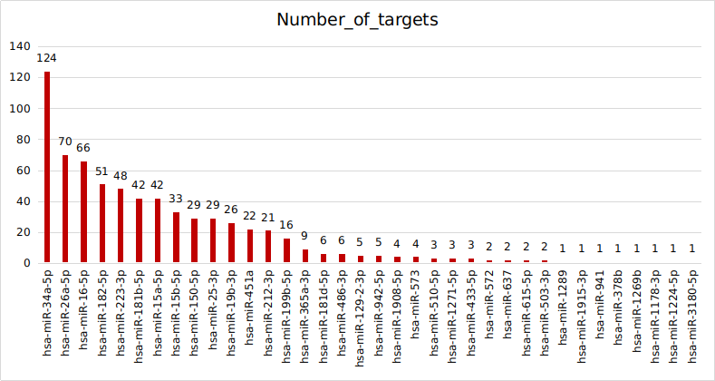

# Diabetes

## Data Information
**Samples**
Diabetes : 3 samples <br>
Control : 3 Samples
<br><br>

**Platform**<br>
Nanostring Ncounter Platform<br><br>
**Probes**<br>
Endogeneous : 798<br>
HouseKeeping : 6<br>
Ligation : 6<br>

## Data Analysis 
Expression data was normalized using `Nsolver` Software

## Differentially Expressed miRNA [DEmiRNA]
```
DEmiRNA : 51
Fold Change : 1.5
P-value : <= 0.05

DEmiRNA : 15
Fold Change : 2
P-value : <= 0.05    
```

## miRNA Target Interaction (MTI)
Experimentally Validated MTI was retrived from MiRTarBase
<br>
**Experiments**
```
Luciferase reporter assay
ELISA
Reporter assay
Flow
Western blot
qRT-PCR
Luciferase assay
Immunofluorescence
GFP reporter assay
Immunohistochemistry
Immunocytochemistry
In situ hybridization
Northern blot
Immunoprecipitaion
Immunoblot
Microarray
FACS
Chromatin immunoprecipitation
ChIP-seq
Proteomics
Flow cytometry
ChIP
EMSA
```

### Filtering miRNA-targets
**Support Type**

```
Functional MTI
Functional MTI (Weak)
Non-Functional MTI
Non-Functional MTI (Weak)
```


Considered only `Functional MTI` from the `Support Type`



## Functional Enrichment Analysis
The targets of `DEmiRNAs` for given for functional enrichment. <br>

The ontologies were further filtered with keywords:
```
insulin
glucagon
glucose
lipid
```


```python

```
